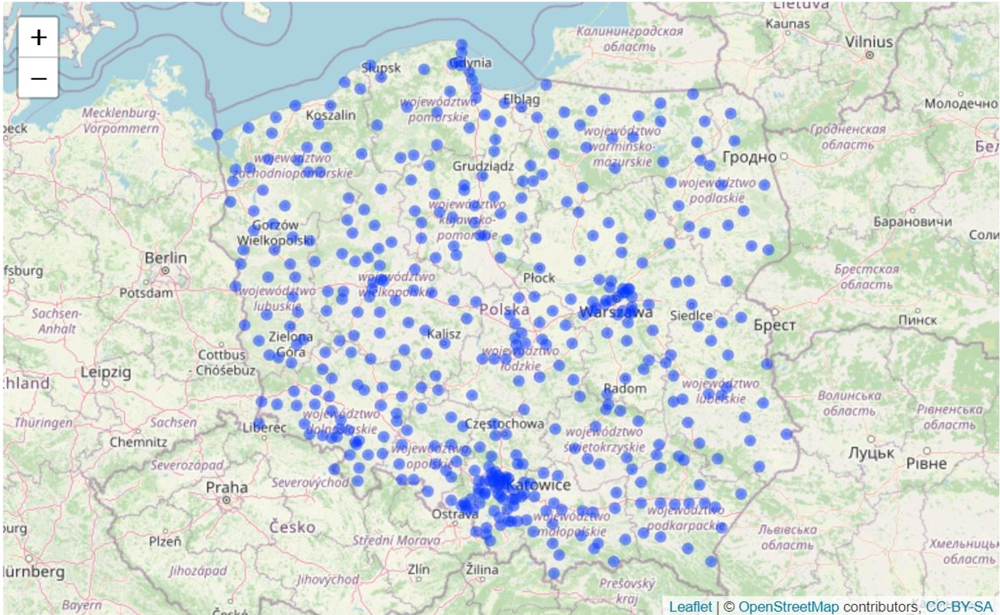
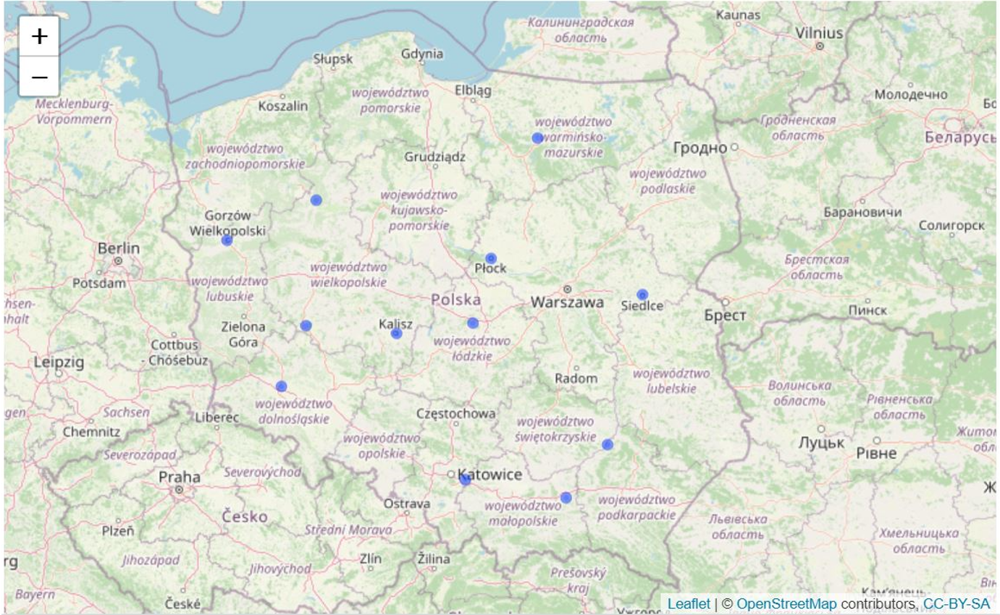
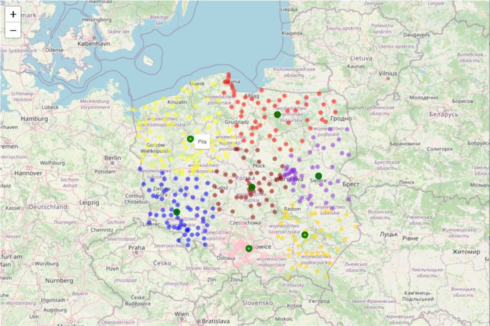

```{r setup, include = FALSE}
knitr::opts_chunk$set(echo = TRUE, include = TRUE, warning = FALSE, message = FALSE, fig.pos = "H", fig.width = 12, fig.height = 6)
```

<br/>
<br/>
<br/>

### Purpose and objectives
<br/>
**Linear optimization** is yet another example how Supply Chain can benefit open source software
like R. In this example we'll look into supply chain network design. 

The **goal** is to give decision makers options to select location and number of warehouses (DCs) to distribute their product (vaccine) on the basis of: <br/>
• total cost made of transportation and warehouses cost (fixed and variable) <br/>
• other factors like total distance (based on customer location and batch size) or maximum distance from customer (which can impact delivery time).

Linear optimization is done using ompr package but since we'll be working with spatial data, we'll also use maps, geosphere and leaflet libraries. As always, tidyverse library will be helpful to transform and visualize data supported be a few other packages.


**List of all required libraries.**

```{r}
library(tidyverse)
library(magrittr)
library(leaflet)
library(maps)
library(geosphere)
library(ompr)
library(ompr.roi)
library(ROI.plugin.glpk)
library(scales)
library(measurements)
library(gridExtra)
```

Let's first collect spatial details for all cities in Poland using maps package, namely world.cities dataset which includes spatial information about each city.
Demand for vaccine can be calculated on the basis of cities' population. We assume that all people wants to get vaccinated. One transport batch of the product is 1k units.

```{r}
pol_city <- maps::world.cities %>% 
  filter(country.etc == 'Poland') %>%
  mutate(demand = ceiling(pop*2),
         no_of_shipments = ceiling(demand/1000))
```

From the list of cities we can also select potential 12 DCs. Each DCs has assigned colour. It's a simple trick that will help us in the future with visualization.

```{r}
pol_dc <- pol_city %>%
  filter(name %in% c('Tarnobrzeg','Siedlce','Plock','Zgierz',
                            'Jaworzno', 'Tarnow', "Legnica", "Leszno", "Kalisz",
                            "Pila", "Olsztyn", "Gorzow Wielkopolski"))

# color-coding for DC visualization
colors <- c("orange", "pink", "darkblue", "blue", "grey", "red", "yellow", 
            "green", "blueviolet", "gold", "brown", "darkred")

# binding all columns together
pol_dc <- cbind(pol_dc, colors)
```

Visualization of cities and warehouses can be done with leaflet package using below code. This will output interactive html map which unfortunately cannot be displayed on github so instead I'll show static PNG file. I encourage however to run it locally.

```{r eval = FALSE}
leaflet(pol_city) %>%
  addTiles() %>%
  addCircleMarkers(lat = ~lat,
                   lng = ~long,
                   radius = 2)
```

Here's map of Poland with all cities...
```{r}

```


```{r eval = FALSE}
leaflet(pol_dc) %>%
  addTiles() %>%
  addCircleMarkers(lat = ~lat,
                   lng = ~long,
                   radius = 2)
```

... and a map with location of potential DCs.

```{r}

```


### Preparation steps for linear optimization 
<br/>
We already have information about geolocation of all cities (customers) and their demand and list of twelve potential DCs.

Additional information required as input to optimization: <br/>

1. fixed WH costs and handling costs (per unit).

```{r}
set.seed(1234)

dc_fix <- round(runif(length(pol_dc$name), 500000, 600000))

dc_han <- round(runif(length(pol_dc$name), 0.06, 0.08), 2)
```

2. distance matrix (in km) between customers and DCs, which will also act as transportation cost calculated as km * 1PLN.

```{r}
dist_mat <- geosphere::distm(x = cbind(pol_city$long, pol_city$lat),
                             y = cbind(pol_dc$long, pol_dc$lat)) %>%
  #convert from meters (default) to kilometers
  measurements::conv_unit('m','km') %>%
  round()

# rownames and colnames
row.names(dist_mat) = pol_city$name
colnames(dist_mat) = pol_dc$name
```

3. total distance matrix which includes number of shipments

```{r}
# distance matrix adjusted by no of shipments
tot_dist_mat <- dist_mat * pol_city$no_of_shipments
```

4. cost matrices which serve two key purposes: objective in optimization (next to distance optimization) and ability to summarize cost breakdown for decision making.
To simplify calculations on matrices, let's makes sure they all have same dimensions.<br/>

a. transportation cost matrix (based on distance and number of shipments)
```{r}
t_c_mat <- tot_dist_mat
```

b. handling cost matrix
```{r}
h_c_mat <- matrix(rep(dc_han, dim(dist_mat)[1]),
                  ncol = dim(dist_mat)[2], 
                  byrow = TRUE) * pol_city$demand
```

c. fixed cost matrix
```{r}
f_c_mat <- matrix(rep(dc_fix, dim(dist_mat)[1]),
                  ncol = dim(dist_mat)[2], 
                  byrow = TRUE)
```

d. total cost matrix
```{r}
tot_c_mat <- t_c_mat + h_c_mat + f_c_mat 
```

5. matrices iterators which reflect number of cities and DCs (dimension of matrices)
```{r}
c_count <- nrow(pol_city)
d_count <- nrow(pol_dc)
```


### Linear optimization
<br/>

Linear optimization is performed using ompr library. We first need to specify optimization variables, constraints and objective.

**Variables:** <br/>
• x is binary decision variable. It's interpretation is: for each customer, which DC to align to? <br/>
• y is binary decision variable: open DC or no?

**Constraints:** <br/>
• each customer aligned to 1 and only 1 DC <br/>
• assigned DC must be opened <br/>
• set fixed number of opened DCs <br/>

We could add additional constraints, like maximum distance to customer, maximum total distance to distribute all products or constraint like minimum number of customers per DC.
The only watch-out to highlight is that the more constraints we add, the longer optimization can take and the bigger chance that no optimal solution can be found. It make take some trial and error to configure list and values for all constraints and it is good opportunity to build Shiny web application.

Our **objective** is to minimize total distance (which includes number of shipments) between customers and DCs (alternative objective could be to minimize cost).

Linear optimization problem will be solved using 'glpk' engine.


### Linear optimization based on number of DCs
<br/>

The question that we would like to answer is **'what is the optimal number of DCs in our distribution network?'**. We will consider cost and distance related factors. We aim to minimize total distance between customers and DC(s) but to answer this question we need to prepare summary for each option (one DC to twelve DCs).

We'll perform this check in a loop, iterating by number of DCs. Let's prepare iterators and containers to capture results which will be further summarized.

```{r}
n <- length(pol_dc$name)

optimization_overview <- list()
optimization_results <- list()
```

It takes a few minutes to execute below code so it also good to save results afterwards...

```{r eval = FALSE}

for (i in 1:n) {

  wh_model <- ompr::MIPModel() %>%
    # binary decision variables (Yes/No - 1/0): 
    # 1. x: for each customer, which DC to align to?
    add_variable(x[ci, di], ci = 1:c_count, di = 1:d_count, type = 'binary') %>%
    # 2. y: open a DC or no?
    add_variable(y[di], di = 1:d_count, type = 'binary') %>%
    # 1st constraint: each customer aligned to 1 and only 1 DC
    add_constraint(sum_expr(x[ci, di], di = 1:d_count) == 1, ci = 1:c_count) %>%
    # 2nd constraint: assigned DC must be opened
    add_constraint(x[ci, di] <= y[di], ci = 1:c_count, di = 1:d_count) %>%
    # 3rd constraint: set the number of opened DCs
    add_constraint(sum_over(y[di], di = 1:d_count) == i) %>%
    set_objective(sum_expr(x[ci, di] * tot_dist_mat[ci, di], ci = 1:c_count, di = 1:d_count),
                  sense = 'min')
  
  wh_solution <- ompr::solve_model(wh_model,
                                   with_ROI(solver = "glpk",
                                            verbose = FALSE))
  
  wh_solution_df <- get_solution(wh_solution, x[ci, di]) %>%
    dplyr::filter(value == 1) %>%
    dplyr::select(ci, di) %>%
    dplyr::mutate(Customer_City = pol_city$name[ci],
                  Demand = pol_city$demand[ci],
                  No_Of_Shipments = pol_city$no_of_shipments[ci],
                  Customer_Lat = pol_city$lat[ci],
                  Customer_Lng = pol_city$long[ci],
                  DC_City = pol_dc$name[di],
                  DC_Lat = pol_dc$lat[di],
                  DC_Lng = pol_dc$long[di],
                  DC_Color = pol_dc$color[di],
                  Route_Distance = dist_mat[cbind(ci, di)],
                  Total_Distance = tot_dist_mat[cbind(ci, di)],
                  Transport_Cost = t_c_mat[cbind(ci, di)],
                  Handling_Cost = h_c_mat[cbind(ci, di)],
                  Fixed_Cost = f_c_mat[cbind(ci, di)])
  
  optimization_results[[i]] <- wh_solution_df
  
  optimization_overview[[i]] <- wh_solution_df %>%
    summarize(sum_customers = n(),
              sum_demand = sum(Demand),
              sum_shipments = sum(No_Of_Shipments),
              max_route_distance = max(Route_Distance),
              sum_total_distance = sum(Total_Distance),
              sum_transp_cost = sum(Transport_Cost),
              sum_handling_cost = sum(Handling_Cost)) %>%
    mutate(no_of_wh = i)
  
  # sum of fixed costs
  optimization_overview[[i]]$sum_fixed_cost <- wh_solution_df %>%
    group_by(di) %>%
    summarize(mean(Fixed_Cost)) %>%
    sum()
  
}

saveRDS(optimization_overview, file = "R_objects/optimization_overview.RDS")
saveRDS(optimization_results, file = "R_objects/optimization_results.RDS")
```

... which can be read into our environment.
```{r}
optimization_overview <- readRDS(file = "R_objects/optimization_overview.RDS")
optimization_results <- readRDS(file = "R_objects/optimization_results.RDS")
```

Our containers are lists, let's change the format to tibble in order to use potential of tidyverse packages. This will be required to calculate sum of wh cost or sum of total costs or to change tibble format from wide to long which supports visualizations in ggplot2. 

```{r}
overview_summary <- do.call(rbind.data.frame, optimization_overview) %>%
  mutate(sum_wh_cost = sum_handling_cost + sum_fixed_cost,
         sum_total_cost = sum_wh_cost + sum_transp_cost) %>%
  pivot_longer(!no_of_wh, names_to = 'measure', values_to = "value")
```

### Linear optimization results
<br/>

Let's look into cost overview. We're interested in sum of transportation costs, sum of warehousing cost (made of handling and fixed costs) and total cost. 

```{r}
p1 <- overview_summary %>%
  filter(measure %in% c('sum_transp_cost', 'sum_wh_cost', 'sum_total_cost')) %>%
  ggplot(aes(x = no_of_wh, y = value, color = measure)) +
  geom_line() +
  scale_x_continuous(breaks = seq(1, n, by = 1)) +
  scale_y_continuous(labels = comma, expand = c(0, 0), limits = c(0, NA)) +
  theme_light() +
  theme(legend.position = "bottom", legend.title = element_blank()) +
  labs(title = "Cost summary based on warehousing and transportation costs.",
       x = "Number of warehouses",
       y = "Cost (PLN)")
p1
```

We can do the same to understand logistical implications from selection of given number of DCs.
Let's look into total distance that will be covered to distribute all vaccines...

```{r}
#visualization of total distance
p2 <- overview_summary %>%
  filter(measure %in% c('sum_total_distance')) %>%
  ggplot(aes(x = no_of_wh, y = value, color = measure)) +
  geom_line() +
  scale_x_continuous(breaks = seq(1, n, by = 1)) +
  scale_y_continuous(labels = comma, expand = c(0, 0), limits = c(0, NA)) +
  theme_light() +
  theme(legend.position = "none") +
  labs(title = "Total distance based on number of warehouses.",
       x = "Number of warehouses",
       y = "Total distance (km)")
p2
```

... and longest route from DC to farthest customer (which has direct impact on lead time and customer satisfaction).

```{r}
p3 <- overview_summary %>%
  filter(measure %in% c('max_route_distance')) %>%
  ggplot(aes(x = no_of_wh, y = value)) +
  #geom_bar(stat = 'identity') +
  geom_line() +
  scale_x_continuous(breaks = seq(1, n, by = 1)) +
  scale_y_continuous(labels = comma, expand = c(0, 0), limits = c(0, NA)) +
  theme(legend.position = "bottom", legend.title = element_blank()) +
  labs(title = "Max route distance to customer based on number of warehouses.",
       x = "Number of warehouses",
       y = "Distance (km)") +
  theme_light()
p3
```

Visualization of costs and distance help make a decision regarding number of DCs that we would like to include in our network. Typically there is a trade-off between cost and service and this is exactly why options should be given to decision makers.

Based on cost and distance overview we will select seven DCs. Let's see which ones support our objective to minimize total distance.
Below code generates interactive html map. We can see location on each DC and colour-coded cities which belong to each DC. We can also hover over DC to get it's name. Leaflet also allows more fancy visualizations but let's keep it simple.

All details of our network with seven DCs are kept in 'optimization_results' list and can be easily subset for visualization.

```{r eval = FALSE}
leaflet(optimization_results[[7]]) %>%
  addTiles() %>%
  addCircleMarkers(lat = ~Customer_Lat,
                   lng = ~Customer_Lng,
                   color = ~DC_Color,
                   radius = 2) %>%
  addCircleMarkers(lat = ~ DC_Lat,
                   lng = ~ DC_Lng,
                   color = 'Green',
                   fill = TRUE,
                   fillColor = ~DC_Color,
                   label = ~DC_City,
                   radius = 4)
```

Since html cannot be displayed on github due to size limitations below is static representation of above code.

```{r}

```

We can also prepare tabular summary of our solution grouped by DC. It gives all necessary information like number of customers, demand and distance overview or costs summary.

```{r}
solution_summary <- optimization_results[[7]] %>%
  group_by(DC_City) %>%
  summarize(sum_customers = n(),
            sum_demand = sum(Demand),
            sum_shipments = sum(No_Of_Shipments),
            max_route_distance = max(Route_Distance),
            sum_total_distance = sum(Total_Distance),
            sum_transp_cost = sum(Transport_Cost),
            sum_handling_cost = sum(Handling_Cost),
            sum_fixed_cost = mean(Fixed_Cost)) %>%
  mutate(sum_total_cost = sum_transp_cost + sum_handling_cost + sum_fixed_cost) %>%
  ungroup()

knitr::kable(solution_summary)
```

### Summary
<br/>

**Open source software like R provide with all necessary tools to perform linear optimization which can help supply chain professionals**. Above example supports network design and helps decision makers select optimal number and location of DCs taking into account cost, logistical and service related factors. <br/>
If such activity is performed more frequently and require more constraints good idea could be Shiny web application with user friendly interface. Example of such app can be soon found in my repository.

