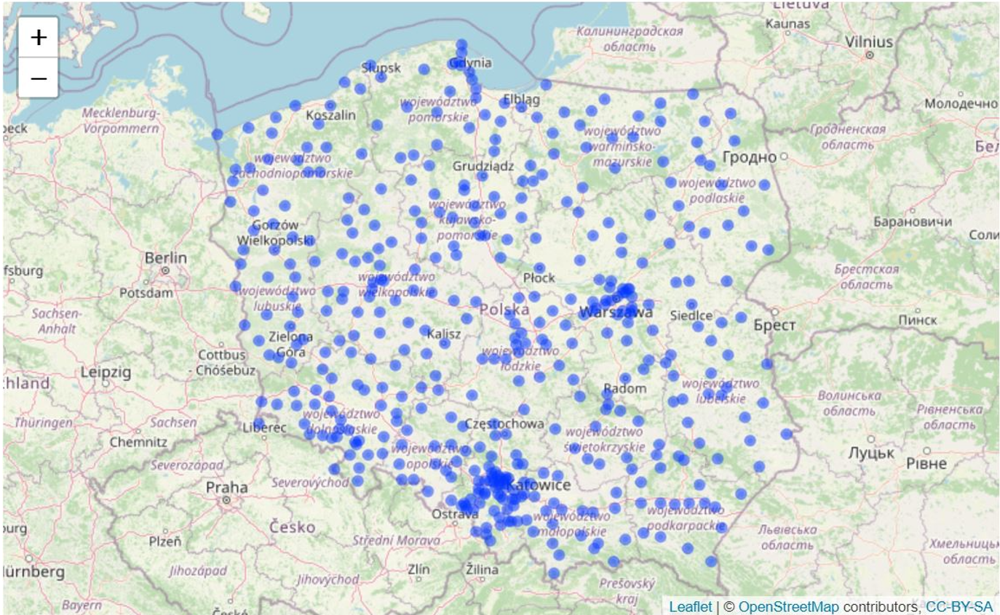
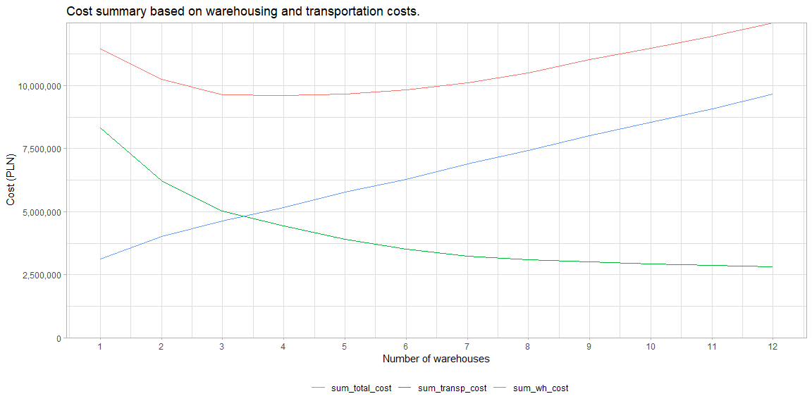

Network Optimization with R
================
Maciej Lecicki
19.03.2022

<br/> <br/> <br/>

### Purpose and objectives

Linear optimization is yet another example how Supply Chain can benefit
open source software like R. In this example we’ll look into supply
chain network design. The goal is to give decision makers options to
select location and number of warehouses (DCs) to distribute their
product (vaccine) on the basis of total cost made of transportation and
warehouses cost (fixed and variable) or factors like total distance
(based on customer location and batch size) or maximum distance from
customer (which can impact delivery time). Linear optimization is done
using ompr package but since we’ll be working with spatial data, we’ll
also use maps and leaflet libraries. As always, tidyverse library will
be helpful to transform and visualize data.

List of libraries is available below.

``` r
library(tidyverse)
library(magrittr)
library(leaflet)
library(maps)
library(ompr)
library(ompr.roi)
library(ROI.plugin.glpk)
library(scales)
library(gridExtra)
```

Let’s first collect spatial details for all cities in Poland using maps
package, namely world.cities dataset which includes spatial information
about each city. Demand for vaccine can be calculated on the basis of
cities’ population. We assume that all people wants to get vaccinated.
One transport batch of the product is 1k units.

``` r
pol_city <- maps::world.cities %>% 
  filter(country.etc == 'Poland') %>%
  mutate(demand = ceiling(pop*2),
         no_of_shipments = ceiling(demand/1000))
```

From the list of cities we can also select potential 12 DCs. Each DCs
has assigned colour. It’s a simple trick that will help us in the future
with visualization.

``` r
pol_dc <- pol_city %>%
  filter(name %in% c('Tarnobrzeg','Siedlce','Plock','Zgierz',
                            'Jaworzno', 'Tarnow', "Legnica", "Leszno", "Kalisz",
                            "Pila", "Olsztyn", "Gorzow Wielkopolski"))

# color-coding for DC visualization
colors <- c("orange", "pink", "darkblue", "blue", "grey", "red", "yellow", 
            "green", "blueviolet", "gold", "brown", "darkred")

# binding all columns together
pol_dc <- cbind(pol_dc, colors)
```

Visualization of cities and warehouses can be done with leaflet package
using below code. This will output interactive html map which
unfortunately cannot be displayed on github so instead I’ll show static
PNG file. I encourage however to run it locally.

``` r
leaflet(pol_city) %>%
  addTiles() %>%
  addCircleMarkers(lat = ~lat,
                   lng = ~long,
                   radius = 2)
```

Here’s map of Poland with all cities…

``` r

```

<!-- -->

``` r
leaflet(pol_dc) %>%
  addTiles() %>%
  addCircleMarkers(lat = ~lat,
                   lng = ~long,
                   radius = 2)
```

… and a map with location of potential DCs.

``` r
knitr::include_graphics("images/pol_dc.png")
```

<!-- -->

### Linear optimization

To be continued…

``` r
# fixed and handling costs of the DC
set.seed(1234)

dc_fix <- round(runif(length(pol_dc$name), 500000, 600000))

dc_han <- round(runif(length(pol_dc$name), 0.06, 0.08), 2)
```

``` r
# create a distance matrix between the demand points and DCs
# this will also act as transportation cost (1PLN/km)
dist_mat <- geosphere::distm(x = cbind(pol_city$long, pol_city$lat),
                             y = cbind(pol_dc$long, pol_dc$lat)) %>%
  #convert from meters (default) to miles
  measurements::conv_unit('m','km') %>%
  round()

# distance matrix adjusted by no of shipments
tot_dist_mat <- dist_mat * pol_city$no_of_shipments

# rownames and colnames
row.names(dist_mat) = pol_city$name
colnames(dist_mat) = pol_dc$name
```

``` r
# create total cost matrix, made of:

# 1. #transportation cost based on batch size and distance
t_c_mat <- tot_dist_mat

# 2. handling cost matrix
h_c_mat <- matrix(rep(dc_han, dim(dist_mat)[1]),
                  ncol = dim(dist_mat)[2], 
                  byrow = TRUE) * pol_city$demand

# 3. fixed cost
f_c_mat <- matrix(rep(dc_fix, dim(dist_mat)[1]),
                  ncol = dim(dist_mat)[2], 
                  byrow = TRUE)

# total cost
tot_c_mat <- t_c_mat + h_c_mat + f_c_mat 
```

``` r
# no of customers and DCs
c_count <- nrow(pol_city)
d_count <- nrow(pol_dc)
```

``` r
n <- length(pol_dc$name)

optimization_overview <- list()
optimization_results <- list()
```

``` r
# optimization model

for (i in 1:n) {

  wh_model <- ompr::MIPModel() %>%
    # binary decision variables (Yes/No - 1/0): 
    # 1. x: for each customer, which DC to align to?
    add_variable(x[ci, di], ci = 1:c_count, di = 1:d_count, type = 'binary') %>%
    # 2. y: open a DC or no?
    add_variable(y[di], di = 1:d_count, type = 'binary') %>%
    # 1st constraint: each customer aligned to 1 and only 1 DC
    add_constraint(sum_expr(x[ci, di], di = 1:d_count) == 1, ci = 1:c_count) %>%
    # 2nd constraint: assigned DC must be opened
    add_constraint(x[ci, di] <= y[di], ci = 1:c_count, di = 1:d_count) %>%
    # 3rd constraint: set the number of opened DCs
    add_constraint(sum_over(y[di], di = 1:d_count) == i) %>%
    set_objective(sum_expr(x[ci, di] * tot_dist_mat[ci, di], ci = 1:c_count, di = 1:d_count),
                  sense = 'min')
  
  wh_solution <- ompr::solve_model(wh_model,
                                   with_ROI(solver = "glpk",
                                            verbose = FALSE))
  
  wh_solution_df <- get_solution(wh_solution, x[ci, di]) %>%
    dplyr::filter(value == 1) %>%
    dplyr::select(ci, di) %>%
    dplyr::mutate(Customer_City = pol_city$name[ci],
                  Demand = pol_city$demand[ci],
                  No_Of_Shipments = pol_city$no_of_shipments[ci],
                  Customer_Lat = pol_city$lat[ci],
                  Customer_Lng = pol_city$long[ci],
                  DC_City = pol_dc$name[di],
                  DC_Lat = pol_dc$lat[di],
                  DC_Lng = pol_dc$long[di],
                  DC_Color = pol_dc$color[di],
                  Route_Distance = dist_mat[cbind(ci, di)],
                  Total_Distance = tot_dist_mat[cbind(ci, di)],
                  Transport_Cost = t_c_mat[cbind(ci, di)],
                  Handling_Cost = h_c_mat[cbind(ci, di)],
                  Fixed_Cost = f_c_mat[cbind(ci, di)])
  
  optimization_results[[i]] <- wh_solution_df
  
  optimization_overview[[i]] <- wh_solution_df %>%
    summarize(sum_customers = n(),
              sum_demand = sum(Demand),
              sum_shipments = sum(No_Of_Shipments),
              max_route_distance = max(Route_Distance),
              sum_total_distance = sum(Total_Distance),
              sum_transp_cost = sum(Transport_Cost),
              sum_handling_cost = sum(Handling_Cost)) %>%
    mutate(no_of_wh = i)
  
  # sum of fixed costs
  optimization_overview[[i]]$sum_fixed_cost <- wh_solution_df %>%
    group_by(di) %>%
    summarize(mean(Fixed_Cost)) %>%
    sum()
  
}

saveRDS(optimization_overview, file = "R_objects/optimization_overview.RDS")
saveRDS(optimization_results, file = "R_objects/optimization_results.RDS")
```

``` r
optimization_overview <- readRDS(file = "R_objects/optimization_overview.RDS")
optimization_results <- readRDS(file = "R_objects/optimization_results.RDS")
```

``` r
# data frame and wh cost measure
overview_summary <- do.call(rbind.data.frame, optimization_overview) %>%
#  as_tibble() %>%
  mutate(sum_wh_cost = sum_handling_cost + sum_fixed_cost,
         sum_total_cost = sum_wh_cost + sum_transp_cost) %>%
  pivot_longer(!no_of_wh, names_to = 'measure', values_to = "value")
```

``` r
#visualization of cost
p1 <- overview_summary %>%
  filter(measure %in% c('sum_transp_cost', 'sum_wh_cost', 'sum_total_cost')) %>%
  ggplot(aes(x = no_of_wh, y = value, color = measure)) +
  geom_line() +
  scale_x_continuous(breaks = seq(1, n, by = 1)) +
  scale_y_continuous(labels = comma, expand = c(0, 0), limits = c(0, NA)) +
  theme_light() +
  theme(legend.position = "bottom", legend.title = element_blank()) +
  labs(title = "Cost summary based on warehousing and transportation costs.",
       x = "Number of warehouses",
       y = "Cost (PLN)")

p1
```

<!-- -->

``` r
#visualization of total distance
p2 <- overview_summary %>%
  filter(measure %in% c('sum_total_distance')) %>%
  ggplot(aes(x = no_of_wh, y = value, color = measure)) +
  geom_line() +
  scale_x_continuous(breaks = seq(1, n, by = 1)) +
  scale_y_continuous(labels = comma, expand = c(0, 0), limits = c(0, NA)) +
  theme_light() +
  theme(legend.position = "none") +
  labs(title = "Total distance based on number of warehouses.",
       x = "Number of warehouses",
       y = "Total distance (km)")

p2
```

<!-- -->

``` r
# max route distance to a customer

p3 <- overview_summary %>%
  filter(measure %in% c('max_route_distance')) %>%
  ggplot(aes(x = no_of_wh, y = value)) +
  #geom_bar(stat = 'identity') +
  geom_line() +
  scale_x_continuous(breaks = seq(1, n, by = 1)) +
  scale_y_continuous(labels = comma, expand = c(0, 0), limits = c(0, NA)) +
  theme(legend.position = "bottom", legend.title = element_blank()) +
  labs(title = "Max route distance to customer based on number of warehouses.",
       x = "Number of warehouses",
       y = "Distance (km)") +
  theme_light()

p3
```

<!-- -->

``` r
# visualization of model with 7 warehouses

leaflet(optimization_results[[7]]) %>%
  addTiles() %>%
  addCircleMarkers(lat = ~Customer_Lat,
                   lng = ~Customer_Lng,
                   color = ~DC_Color,
                   radius = 2) %>%
  addCircleMarkers(lat = ~ DC_Lat,
                   lng = ~ DC_Lng,
                   color = 'Green',
                   fill = TRUE,
                   fillColor = ~DC_Color,
                   label = ~DC_City,
                   radius = 4)
```

``` r
knitr::include_graphics("images/seven_wh.png")
```

<!-- -->

``` r
#optimization summary

solution_summary <- optimization_results[[7]] %>%
  group_by(DC_City) %>%
  summarize(sum_customers = n(),
            sum_demand = sum(Demand),
            sum_shipments = sum(No_Of_Shipments),
            max_route_distance = max(Route_Distance),
            sum_total_distance = sum(Total_Distance),
            sum_transp_cost = sum(Transport_Cost),
            sum_handling_cost = sum(Handling_Cost),
            sum_fixed_cost = mean(Fixed_Cost)) %>%
  mutate(sum_total_cost = sum_transp_cost + sum_handling_cost + sum_fixed_cost) %>%
  ungroup()

knitr::kable(solution_summary)
```

| DC_City    | sum_customers | sum_demand | sum_shipments | max_route_distance | sum_total_distance | sum_transp_cost | sum_handling_cost | sum_fixed_cost | sum_total_cost |
|:-----------|--------------:|-----------:|--------------:|-------------------:|-------------------:|----------------:|------------------:|---------------:|---------------:|
| Jaworzno   |            91 |   10542834 |         10584 |                121 |             471159 |          471159 |          843426.7 |         562230 |        1876816 |
| Legnica    |            66 |    5012276 |          5050 |                169 |             337558 |          337558 |          400982.1 |         562338 |        1300878 |
| Olsztyn    |            57 |    4763972 |          4786 |                177 |             524000 |          524000 |          333478.0 |         564031 |        1421509 |
| Pila       |            81 |    6787318 |          6829 |                186 |             716510 |          716510 |          407239.1 |         500950 |        1624699 |
| Siedlce    |            50 |    6219100 |          6246 |                160 |             538389 |          538389 |          435337.0 |         566608 |        1540334 |
| Tarnobrzeg |            46 |    4581486 |          4601 |                158 |             379305 |          379305 |          320704.0 |         551425 |        1251434 |
| Zgierz     |            48 |    4942756 |          4963 |                122 |             257461 |          257461 |          296565.4 |         554497 |        1108523 |
